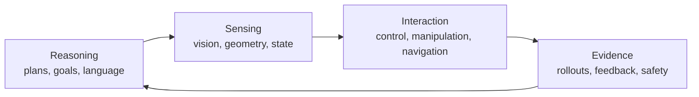

# Physical-RSI

<h1 align="center" style="font-size: 30px;"><strong><em>Physical-RSI</em></strong>: A Living Map of Reasoning, Sensing, and Interaction in the Physical World</h1>

<p align="center">
  <a href="https://github.com/SAIL-Research-Lab/Physical-RSI/actions/workflows/check.yml"></a>
  <a href="https://github.com/SAIL-Research-Lab/Physical-RSI/blob/main/LICENSE"></a>
  <a href="https://github.com/SAIL-Research-Lab/Physical-RSI/blob/main/data/reading-list.json"></a>
</p>

Physical-RSI is a community-maintained map of research on intelligent systems that perceive,
reason about, and act in the physical world. It brings together papers, datasets, simulators,
and open-source systems that are often discussed separately. The goal is not to rank methods or
to predict a single winning architecture. The goal is to make the connections between them easier
to see and easier to check.

The name is a working shorthand for **R**easoning, **S**ensing, and **I**nteraction. It is a
navigation aid for this repository, not a claim that the field has settled on one definition.

> **Status:** working index, first organized edition. The list is intentionally selective and
> will change as the community contributes corrections and better references. This seed list
> emphasizes foundational work through 2024; newer work is welcome.

## The physical loop

Physical systems have to close a loop: a plan is grounded in observations, an action changes the
world, and the result becomes evidence for the next decision. We use that loop to organize the
reading list.



## Contents

- [Foundations of embodied intelligence](#foundations-of-embodied-intelligence)
- [Learning policies and control](#learning-policies-and-control)
- [Language, planning, and tool use](#language-planning-and-tool-use)
- [Perception and world models](#perception-and-world-models)
- [Simulation and environments](#simulation-and-environments)
- [Datasets and benchmarks](#datasets-and-benchmarks)
- [Safety, evaluation, and deployment](#safety-evaluation-and-deployment)
- [How to contribute](#how-to-contribute)
- [Citation](#citation)

The sections below are generated from [`data/reading-list.json`](data/reading-list.json). Each
entry has a stable key, a primary link, its publication year, and a short note explaining why it
belongs in the map. Run `make render` after editing the data file.

The maintenance scripts use Python 3.9 or newer and have no third-party dependencies.

<!-- BEGIN GENERATED READING LIST -->
## Foundations of embodied intelligence

These works establish the idea that a general-purpose model can connect language and perception to actions executed by a real or simulated embodiment.

- [Octo: An Open-Source Generalist Robot Policy](https://arxiv.org/abs/2405.12213) -- Team Octo, 2024. Tags: reasoning, interaction, learning. A generalist policy trained across diverse robot datasets and designed for lightweight adaptation.
- [OpenVLA: An Open-Source Vision-Language-Action Model](https://arxiv.org/abs/2406.09246) -- Kim et al., 2024. Tags: reasoning, sensing, interaction. An openly released VLA that makes large-scale robot-policy research easier to reproduce.
- [PaLM-E: An Embodied Multimodal Language Model](https://arxiv.org/abs/2303.03378) -- Driess et al., 2023. Tags: reasoning, sensing. Connects continuous sensor observations and language reasoning in one embodied model.
- [RT-2: Vision-Language-Action Models Transfer Web Knowledge to Robotic Control](https://arxiv.org/abs/2307.15818) -- Brohan et al., 2023. Tags: reasoning, sensing, interaction. A landmark demonstration of transferring web-scale visual-language knowledge into robot actions.
- [RT-1: Robotics Transformer for Real-World Control at Scale](https://arxiv.org/abs/2212.06817) -- Brohan et al., 2022. Tags: sensing, interaction, learning. Shows how a transformer policy can learn many real-world manipulation tasks from data.

## Learning policies and control

This section covers the mechanisms that turn demonstrations, rewards, or imagined trajectories into reliable low-level behavior.

- [TD-MPC2: Scalable, Robust World Models for Continuous Control](https://arxiv.org/abs/2310.16828) -- Hansen et al., 2024. Tags: interaction, learning, world-models. Demonstrates a compact model-predictive approach across many continuous-control tasks.
- [Diffusion Policy: Visuomotor Policy Learning via Action Diffusion](https://arxiv.org/abs/2303.04137) -- Chi et al., 2023. Tags: interaction, learning. Uses diffusion to model multimodal action distributions for visuomotor control.
- [Learning Fine-Grained Bimanual Manipulation with Low-Cost Hardware](https://arxiv.org/abs/2304.13705) -- Zhao et al., 2023. Tags: interaction, learning. Mobile ALOHA shows how whole-body demonstrations can make long-horizon bimanual skills accessible.
- [Mastering Diverse Domains through World Models](https://arxiv.org/abs/2301.04104) -- Hafner et al., 2023. Tags: interaction, learning, world-models. DreamerV3 is a useful reference point for model-based control with a compact latent state.
- [MimicGen: A Data Generation System for Scalable Robot Learning using Human Demonstrations](https://arxiv.org/abs/2310.17596) -- Mandlekar et al., 2023. Tags: interaction, learning, datasets. Generates scalable imitation-learning data by composing human demonstrations in simulation.

## Language, planning, and tool use

These papers ask how an agent turns a human goal into a sequence of grounded skills, tool calls, or recoverable actions.

- [Code as Policies: Language Model Programs for Embodied Control](https://arxiv.org/abs/2209.07753) -- Liang et al., 2023. Tags: reasoning, interaction, planning. Treats code generation as a bridge between natural-language goals and existing robot APIs.
- [Inner Monologue: Embodied Reasoning through Planning with Language Models](https://arxiv.org/abs/2207.05608) -- Huang et al., 2023. Tags: reasoning, interaction, planning. Feeds execution feedback back into language-model planning instead of assuming an open-loop plan.
- [VoxPoser: Composable 3D Value Maps for Robotic Manipulation with Language Models](https://arxiv.org/abs/2307.05973) -- Huang et al., 2023. Tags: reasoning, sensing, interaction, planning. Grounds language-generated programs in 3D value maps that a controller can execute.
- [Do As I Can, Not As I Say: Grounding Language in Robotic Affordances](https://arxiv.org/abs/2204.01691) -- Ahn et al., 2022. Tags: reasoning, sensing, planning. SayCan separates what is useful for a task from what is physically feasible.

## Perception and world models

An embodied agent needs a state estimate that is useful for action, not only a visually plausible description. This section follows the representations that make that estimate possible.

- [FoundationPose: Unified 6D Pose Estimation and Tracking of Novel Objects](https://arxiv.org/abs/2312.08344) -- Wen et al., 2024. Tags: sensing, perception. Provides a foundation-model style approach to pose estimation for previously unseen objects.
- [3D Gaussian Splatting for Real-Time Radiance Field Rendering](https://arxiv.org/abs/2308.04079) -- Kerbl et al., 2023. Tags: sensing, world-models. Makes high-quality, view-consistent scene representations practical for interactive systems.
- [Segment Anything](https://arxiv.org/abs/2304.02643) -- Kirillov et al., 2023. Tags: sensing, perception. A general segmentation model that has become a practical building block for robot scene understanding.
- [NeRF: Representing Scenes as Neural Radiance Fields for View Synthesis](https://arxiv.org/abs/2003.08934) -- Mildenhall et al., 2020. Tags: sensing, world-models. The foundational neural scene representation behind much subsequent 3D reconstruction work.

## Simulation and environments

Simulation is useful when it exposes assumptions, supports repeatable rollouts, and makes failure measurable. These environments provide the testing ground for that process.

- [RoboCasa: Large-Scale Simulation of Everyday Tasks for Generalist Robots](https://arxiv.org/abs/2406.02523) -- Nasiriany et al., 2024. Tags: interaction, simulation, evaluation. Brings household-scale task diversity to robot-learning simulation.
- [Habitat 3.0: A Co-Habitat for Humans, Avatars and Robots](https://arxiv.org/abs/2310.13724) -- Puig et al., 2023. Tags: sensing, interaction, simulation. Supports embodied navigation and social interaction in shared environments.
- [ManiSkill2: A Unified Benchmark for Generalizable Manipulation Skills](https://arxiv.org/abs/2302.04659) -- Gu et al., 2023. Tags: interaction, simulation, evaluation. A broad manipulation suite with emphasis on visual generalization and physical variation.
- [iGibson 2.0: Object-Centric Simulation for Robot Learning of Everyday Household Tasks](https://arxiv.org/abs/2108.03272) -- Shen et al., 2021. Tags: sensing, interaction, simulation. Connects physically grounded household simulation with large-scale scene assets.

## Datasets and benchmarks

Data and evaluation protocols determine what a system can learn and what a reported number means. The entries here are useful anchors for comparing embodiments, tasks, and generalization claims.

- [DROID: A Large-Scale In-The-Wild Robot Manipulation Dataset](https://arxiv.org/abs/2403.12945) -- Khazatsky et al., 2024. Tags: sensing, interaction, datasets. A diverse real-world dataset designed to capture the variation that laboratory demonstrations often miss.
- [LIBERO: Benchmarking Knowledge Transfer for Lifelong Robot Learning](https://arxiv.org/abs/2306.03310) -- Liu et al., 2023. Tags: interaction, datasets, evaluation. Tests whether a policy can retain and transfer knowledge across task sequences.
- [Open X-Embodiment: Robotic Learning Datasets and RT-X Models](https://arxiv.org/abs/2310.08864) -- Open X-Embodiment Collaboration, 2023. Tags: reasoning, sensing, interaction, datasets. Unifies data from many robots and tasks to study cross-embodiment learning.
- [CALVIN: A Benchmark for Language-Conditioned Policy Learning for Long-Horizon Robot Manipulation Tasks](https://arxiv.org/abs/2112.03227) -- Mees et al., 2022. Tags: reasoning, interaction, datasets, evaluation. Measures language-conditioned, long-horizon manipulation with compositional task chains.
- [Meta-World: A Benchmark and Evaluation for Multi-Task and Meta Reinforcement Learning](https://arxiv.org/abs/1910.10897) -- Yu et al., 2020. Tags: interaction, datasets, evaluation. A standard suite for multi-task and meta-learning in simulated manipulation.
- [RLBench: The Robot Learning Benchmark & Learning Environment](https://arxiv.org/abs/1909.12271) -- James et al., 2019. Tags: interaction, simulation, datasets, evaluation. Provides a large set of language-described manipulation tasks in a common simulator.

## Safety, evaluation, and deployment

Physical systems fail in ways that a single success rate cannot describe. These resources foreground constraints, risk, robustness, and the difference between a demonstration and a deployable system.

- [Safety-Gymnasium: A Unified Safe Reinforcement Learning Benchmark](https://arxiv.org/abs/2310.12567) -- Ji et al., 2023. Tags: interaction, safety, evaluation. A maintained benchmark for measuring reward and constraint satisfaction together.
- [Train Offline, Test Online: A Real Robot Learning Benchmark](https://arxiv.org/abs/2306.00942) -- Singh et al., 2023. Tags: interaction, evaluation. Separates offline training from online evaluation on a real robot, making deployment gaps explicit.
- [OpenAI Safety Gym](https://github.com/openai/safety-gym) -- Ray et al., 2019. Tags: interaction, safety, evaluation. Established a common language for constrained reinforcement-learning experiments.

<!-- END GENERATED READING LIST -->

## How to contribute

The index is deliberately maintained like a reading group rather than a leaderboard. A useful
addition has a clear connection to the physical loop and enough public evidence for another reader
to follow it.

1. Add or correct an entry in [`data/reading-list.json`](data/reading-list.json). Keep one primary
   link per work, use the canonical title, and write a note that says what the work contributes.
2. Run `make check`. The check catches duplicate keys and URLs, malformed metadata, and a stale
   generated section in this README.
3. Open a pull request. Please explain why an entry belongs in its chosen category; corrections to
   titles, years, and links are especially welcome.

Editorial decisions and the schema are documented in [`docs/maintenance.md`](docs/maintenance.md)
and [`docs/taxonomy.md`](docs/taxonomy.md). The list favors primary papers, public datasets, and
reusable software. It does not attempt to include every workshop paper, product announcement, or
result that cannot be independently checked.

## Citation

There is no standalone Physical-RSI paper yet. For a fixed snapshot of the index, cite the
repository and include its release date:

```bibtex
@misc{physicalrsi2026,
  title        = {Physical-RSI: A Living Map of Reasoning, Sensing, and Interaction in the Physical World},
  author       = {{SAIL Research Lab}},
  year         = {2026},
  howpublished = {\url{https://github.com/SAIL-Research-Lab/Physical-RSI}},
  note         = {Accessed 2026-09-29}
}
```

The project is released under the MIT License. See [`LICENSE`](LICENSE).
