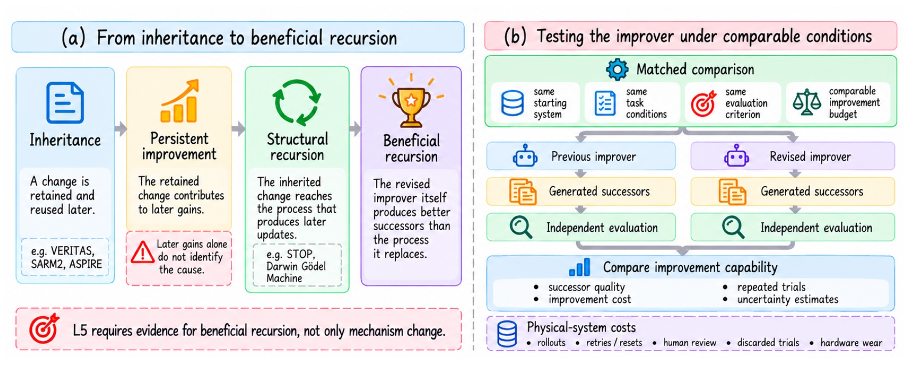
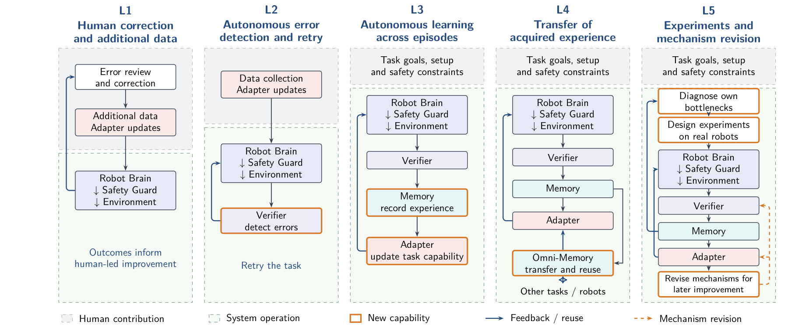
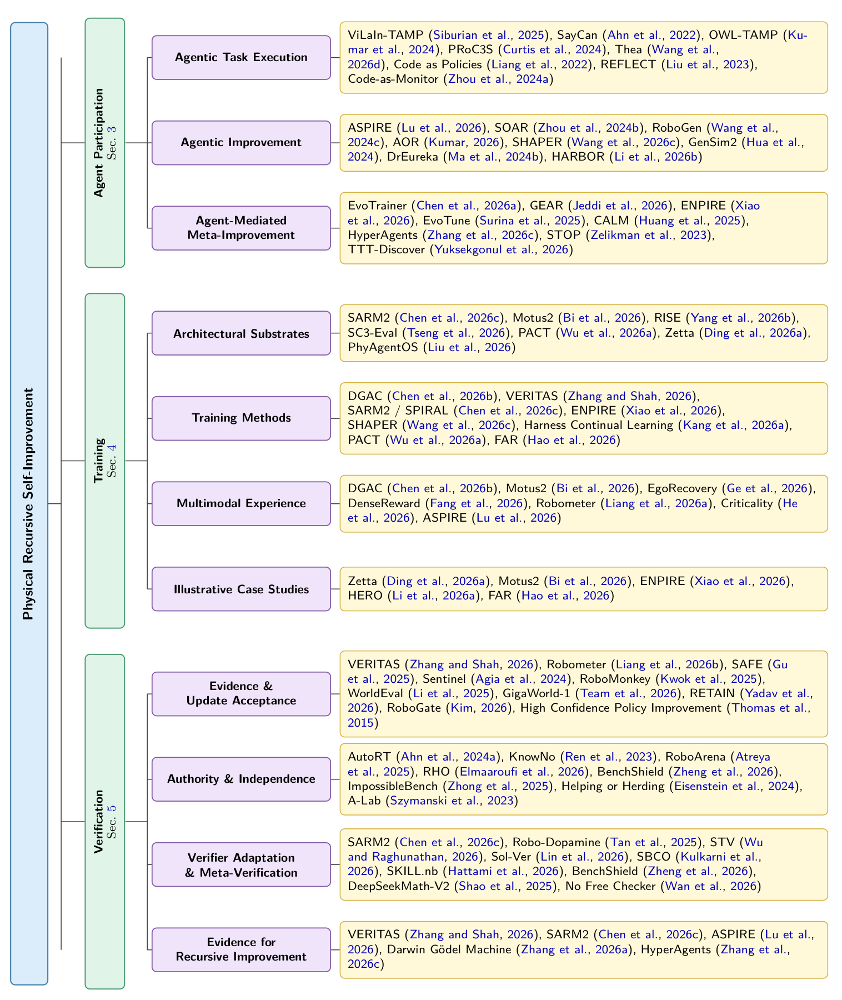

<h1 align="center"><em>Physical RSI</em></h1>

<strong>Physical Recursive Self-Improvement</strong>

  
  
  

  <a href="#the-boundary">The boundary</a> &nbsp;|&nbsp;
  <a href="#capability-map">L1-L5</a> &nbsp;|&nbsp;
  <a href="#three-views-of-one-system">Research map</a> &nbsp;|&nbsp;
  <a href="#open-questions">Open questions</a> &nbsp;|&nbsp;
  <a href="docs/paper-reference-index.md">All references</a>

Physical RSI asks a narrower question than whether robots can keep learning:

> **Can evidence from physical interaction improve the process that produces the robot's next
> improvement?**

A robot may collect more data, recover from a failed grasp, or fine-tune a policy after deployment.
Those are useful forms of adaptation, but they are not recursive by themselves. Recursion begins
when a retained change reaches the mechanism that generates, evaluates, or selects later updates.
It becomes *physical* when real interaction has a causal role in deciding what mechanism changes or
survives.

This repository follows the evidence boundaries of the **Physical Recursive Self-Improvement**
paper. It is a reading map, not a leaderboard: labels such as "self-improving," "autonomous," or
"lifelong" are not treated as evidence on their own.

## The boundary

The relevant "self" is the complete embodied improvement system: policy, safety guard, verifier,
memory, data pipeline, training procedure, and the infrastructure that decides which changes
persist. Deploying a fixed improvement loop on a robot is not enough.

Four claims that are often collapsed should be kept separate:

| Claim | What must be shown |
| --- | --- |
| **Inheritance** | A change from one cycle is retained and used later. |
| **Persistent improvement** | The retained change contributes to better later performance. |
| **Structural recursion** | The retained change modifies the process that produces later updates. |
| **Beneficial recursion** | Under matched conditions, the revised process produces better successors than the process it replaced. |

  

<strong>Figure 14.</strong> Beneficial recursion requires testing the improver, not only its latest successor.

Structural recursion establishes the recursive form. Beneficial recursion establishes that the
recursive change actually helped. A persuasive comparison starts from the same system, uses the
same task conditions and protected evaluation criterion, and accounts for robot trials, resets,
hardware wear, compute, search, and human effort.

## Capability map

L1-L5 are **independent evidence claims**, not a maturity ladder. A workflow may support several
capabilities, and a higher number does not silently establish the levels below it. Classification
applies to the demonstrated workflow, not to the title of a paper.

  

<strong>Figure 3.</strong> Five capability categories of physical self-improvement.

| Capability | Deciding question | Representative evidence |
| --- | --- | --- |
| **L1: Human-supported improvement** | Does a person supply the corrective information that determines what changes? | [ConRFT](https://arxiv.org/abs/2502.05450) learns from robot trajectories containing operator corrections. |
| **L2: Autonomous error recognition and recovery** | Does the system detect an unsatisfactory execution and choose how to recover? | [DoReMi](https://sites.google.com/view/doremi-paper) detects task-constraint violations and replans; [REFLECT](https://arxiv.org/abs/2306.15724) explains failures and proposes repairs. |
| **L3: Autonomous learning across episodes** | Does physical experience produce a system-directed, retained change used later? | [SELFI](https://proceedings.mlr.press/v270/hirose25a.html) improves navigation through autonomous practice; [VERITAS](https://arxiv.org/abs/2606.18247) returns verified rollouts to policy training. |
| **L4: Transfer of acquired experience** | Is the contribution of prior experience demonstrated in another task, scene, environment, or embodiment? | [SOAR](https://arxiv.org/abs/2407.20635) isolates cross-scene experience; [ASPIRE](https://arxiv.org/abs/2607.00272) retrieves discovered skills for real-robot programming. |
| **L5: Physically grounded mechanism improvement** | Does physical evidence revise an inherited improvement mechanism, and does that mechanism produce better later improvements? | [ENPIRE](https://arxiv.org/abs/2606.19980) revises and reuses robot-training code, making it an important **L5 candidate**. It does not yet provide the matched improver comparison required for confirmed L5. |

The paper finds strong evidence for the lower capabilities and early evidence for physically grounded
mechanism revision. It does **not** identify a reviewed physical workflow that conclusively
demonstrates strict, beneficial L5.

## Three views of one system

Agent participation, training, and verification are complementary views of the same improvement
system. The first asks what an agent's output controls; the second asks how experience becomes a
persistent update; the third asks what the system is allowed to carry forward.

  

<strong>Figure 5.</strong> The paper's research landscape and representative systems.

### 1. Agent participation

Agent roles are classified by the later use of their outputs, not by whether those outputs are code,
weights, or text.

| Loop | What the output controls | Representative work |
| --- | --- | --- |
| **Loop 1: Task execution** | The current task: specification, planning, tool use, execution, or outcome interpretation. | [SayCan](https://arxiv.org/abs/2204.01691), [Code as Policies](https://arxiv.org/abs/2209.07753), [Code-as-Monitor](https://arxiv.org/abs/2412.04455) |
| **Loop 2: Capability improvement** | A harness or model capability used in later tasks. | [SOAR](https://arxiv.org/abs/2407.20635), [RoboGen](https://arxiv.org/abs/2311.01455), [DrEureka](https://arxiv.org/abs/2406.01967), [SHAPER](https://arxiv.org/abs/2608.11350) |
| **Loop 3: Meta-improvement** | The procedure that produces or selects future capability improvements. | [ENPIRE](https://arxiv.org/abs/2606.19980), [EvoTrainer](https://arxiv.org/abs/2606.03108), [HyperAgents](https://arxiv.org/abs/2603.19461), [Darwin Godel Machine](https://arxiv.org/abs/2505.22954) |

A reward written for one training run is a Loop 2 input. Changing the procedure that generates or
selects rewards belongs to Loop 3. Digital and simulation studies clarify this boundary, but they do
not become evidence of Physical RSI without physical grounding and inherited use in the same
workflow.

### 2. Training

Training is a continuing, gated process rather than a one-off offline stage:

> **experience collection -> evaluation and credit -> parameter update -> verification and consolidation**

The main architectural substrates expose different objects to this loop:

- **Causal VLA Transformers:** [SARM2](https://arxiv.org/abs/2606.10305) couples stage estimation and value learning to produce dense progress feedback.
- **Unified world-action models:** [Motus2](https://arxiv.org/abs/2608.30237) shares policy, simulator, and evaluator interfaces; [RISE](https://arxiv.org/abs/2602.11075) separates dynamics from progress evaluation for imagined RL.
- **Video-generative world models:** [SC3-Eval](https://arxiv.org/abs/2606.18610) evaluates policies through dynamics, cross-view, and test-time consistency.
- **Constrained diffusion post-training:** [PACT](https://arxiv.org/abs/2606.08414) aligns a pretrained policy under safety and task-progress constraints.

Data selection matters as much as generation. Failures must be represented, imagined experience
must remain calibrated to the real world, and protected evaluation data must not leak into the
self-evolving loop. [FAR](https://arxiv.org/abs/2607.01111), for example, attributes failures to
action blocks and returns successful recoveries to training.

### 3. Verification

Verification enters the loop at three different points:

1. **Behavior verification:** should the current action or trajectory continue?
2. **Data admission:** should this experience enter memory or training?
3. **Update release:** should the resulting change become part of the persistent system?

A trajectory score is not an update-release test. Release may also require retention tests,
out-of-distribution evaluation, safety checks, and evidence that old capabilities have not regressed.
[Robometer](https://arxiv.org/abs/2603.02115), [WorldEval](https://arxiv.org/abs/2505.19017),
[RoboArena](https://arxiv.org/abs/2506.18123), and [SC3-Eval](https://arxiv.org/abs/2606.18610)
cover different parts of this problem.

Two forms of independence matter. **Control independence** prevents a candidate from choosing,
modifying, or bypassing its evaluator. **Information independence** prevents repeated feedback from
turning a protected criterion into another optimization target. More judges do not create independent
evidence when they share the same blind spot.

## Open questions

- **Weight-level self-modification:** no physical system has demonstrated a complete, sustained loop in which its own weight-update process improves and continues to benefit.
- **Judge reliability:** verifier and reward-model errors propagate through the training loop.
- **Imagination-reality gap:** world-model error limits imagined training and evaluation.
- **Forgetting and stability:** new policies, values, and world models can erase earlier competence.
- **Sustained safety:** a continuously changing policy needs more than a one-time safety check.
- **Longitudinal evaluation:** repeated self-evaluation needs protected tests and explicit anti-leakage rules.
- **Transfer of training methods:** transferring a skill is not the same as transferring the procedure that learns it.
- **Theory of recursive training:** we lack conditions for convergence when policy, world model, and evaluator train one another.

## Paper reference coverage

The supplied paper contains **105 bibliography records**. AutoRT, Robometer, and Darwin Godel
Machine each appear twice as preprint and publication records. After consolidating those three
pairs, the repository indexes **all 102 unique works**:

> [Browse the complete Physical RSI paper reference index](docs/paper-reference-index.md)

The full index is separate from the conceptual map on this page so that completeness does not bury
the paper's argument. Inclusion in the bibliography does not imply that a work demonstrates
Physical RSI; the L1-L5 evidence standard still applies.

## Contributing

For a new paper, include its canonical title, primary link, year, the object that changes, the
physical evidence used, whether the change persists, and the comparison that supports the claimed
capability. Simulation-only and digital RSI work are welcome when their scope is stated explicitly.

Please open an issue or pull request for additions and corrections. The repository is intentionally
lightweight: the README carries the conceptual map, and the paper index carries bibliographic
coverage.

## License

This repository is released under the [MIT License](LICENSE).
