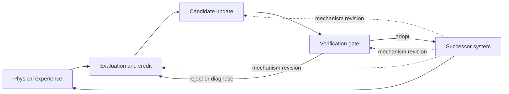

<h1 align="center"><em>Physical RSI</em>: Physical Recursive Self-Improvement</h1>

Physical RSI asks a narrower question than whether robots can keep learning: **can evidence from
physical interaction improve the process that produces the robot's next improvement?**

A robot may collect more data, recover from a failed grasp, or fine-tune a policy after deployment.
All of these are useful, but none is recursive by itself. Recursive self-improvement begins when a
change reaches the mechanism that generates, evaluates, or selects later updates, and that change is
retained for another improvement cycle. It is *physical* only when real interaction has a causal role
in deciding what mechanism changes or survives. Running an otherwise fixed loop on a robot is not
enough.

This repository is a compact research map based on the **Physical Recursive Self-Improvement**
paper. It follows the paper's evidence boundaries rather than treating every system described as
"self-improving" as equivalent. The list is selective and will evolve with the literature.

## Contents

- [What counts as Physical RSI?](#what-counts-as-physical-rsi)
- [Capability map: L1-L5](#capability-map-l1-l5)
- [Agent participation](#agent-participation)
- [Training](#training)
- [Verification](#verification)
- [Open problems](#open-problems)
- [Contributing](#contributing)

## What counts as Physical RSI?

The relevant "self" is the whole embodied improvement system: robot policy, safety guard,
verifier, memory, data pipeline, training procedure, and the infrastructure that decides which
changes persist.

Four claims that are often collapsed should be kept separate:

| Claim | Evidence required |
| --- | --- |
| **Inheritance** | A change from one cycle is retained and used later. |
| **Persistent improvement** | The retained change contributes to better later performance. |
| **Structural recursion** | The retained change modifies the process that produces later updates. |
| **Beneficial recursion** | Under matched conditions, the revised process produces better successors than the process it replaced. |

Structural recursion establishes the recursive form. Beneficial recursion establishes that the
recursive change actually helped. The latter requires testing the **improver**, not merely showing
that its latest policy is better.

## Capability map: L1-L5

L1-L5 are **independent evidence claims**, not a maturity ladder. A workflow may support several
levels, and a higher number does not silently establish the levels below it. Classification applies to
the demonstrated workflow, not to a paper's chosen label.

| Capability | Deciding question | Representative evidence |
| --- | --- | --- |
| **L1: Human-supported improvement** | Does a person provide the corrective information that determines what changes? | [ConRFT](https://arxiv.org/abs/2502.05450) learns from robot trajectories containing operator corrections. |
| **L2: Autonomous error recognition and recovery** | Does the system detect an unsatisfactory execution and choose how to recover? | [DoReMi](https://sites.google.com/view/doremi-paper) detects task-constraint violations and replans. [REFLECT](https://arxiv.org/abs/2306.15724) explains failures and proposes repairs. |
| **L3: Autonomous learning across episodes** | Does physical experience produce a system-directed, retained change used in later episodes? | [SELFI](https://proceedings.mlr.press/v270/hirose25a.html) improves navigation through autonomous real-world practice. [VERITAS](https://arxiv.org/abs/2606.18247) uses visually verified rollouts for later policy fine-tuning. |
| **L4: Transfer of acquired experience** | Is the contribution of prior experience demonstrated in another task, scene, environment, or embodiment? | [SOAR](https://arxiv.org/abs/2407.20635) shows that experience beyond the current scene helps target learning. [ASPIRE](https://arxiv.org/abs/2607.00272) retrieves discovered skills for real-robot programming. |
| **L5: Physically grounded mechanism improvement** | Does physical evidence revise an inherited improvement mechanism, and does that revised mechanism produce better subsequent improvements? | [ENPIRE](https://arxiv.org/abs/2606.19980) revises and reuses robot-training code, so it is an important **L5 candidate**. It does not yet provide the matched improver comparison needed for a confirmed L5 claim. |

At present, the literature contains strong evidence for the lower capabilities and early evidence for
physically grounded mechanism revision. The paper does not identify a reviewed physical workflow
that conclusively demonstrates strict, beneficial L5.

## Agent participation

Agent involvement is best classified by what the agent's output controls in the next cycle. Code,
model weights, and text can appear at any of the three loops; the artifact type does not determine
the level.

### Loop 1: Agentic task execution

The output controls the current task: specifying a goal, planning, invoking robot interfaces, or
interpreting an outcome.

- [SayCan](https://arxiv.org/abs/2204.01691) combines language-based planning with grounded skill affordances.
- [Code as Policies](https://arxiv.org/abs/2209.07753) composes perception and control APIs into executable robot programs.
- [Code-as-Monitor](https://arxiv.org/abs/2412.04455) generates geometric checks for reactive and proactive failure detection.
- [Manipulate-Anything](https://arxiv.org/abs/2406.18915) uses vision-language components to assess completion during real-world manipulation.

### Loop 2: Agentic improvement

The output changes a capability used in later tasks. Agents diagnose experience, choose practice,
generate a harness or model candidate, evaluate it, and retain useful results.

- [SOAR](https://arxiv.org/abs/2407.20635) collects and filters autonomous robot practice for subsequent policy training.
- [RoboGen](https://arxiv.org/abs/2311.01455) generates tasks, environments, and learning signals for automated skill learning.
- [Eureka](https://arxiv.org/abs/2310.12931) and [DrEureka](https://arxiv.org/abs/2406.01967) generate reward code and sim-to-real training conditions.
- [SHAPER](https://arxiv.org/abs/2608.11350) evolves reusable skills together with their execution harness in simulation.
- [HARBOR](https://arxiv.org/abs/2606.08610) retains and retrieves experience from agentic robot-RL experiments.

### Loop 3: Agent-mediated meta-improvement

The output changes how future capability improvements are produced. A reward written for one
training run belongs to Loop 2; changing the procedure that generates or selects rewards belongs to
Loop 3.

- [ENPIRE](https://arxiv.org/abs/2606.19980) lets a coding agent edit learning algorithms and training infrastructure from real-robot results.
- [EvoTrainer](https://arxiv.org/abs/2606.03108) co-evolves agent policies and the training harness used to improve them.
- [GEAR](https://arxiv.org/abs/2605.13874) evolves coding-agent search procedures from diagnostic feedback.
- [HyperAgents](https://arxiv.org/abs/2603.19461) evaluates an improver by the descendants it creates under a fixed budget, including simulated reward-design tasks.
- [Darwin Godel Machine](https://arxiv.org/abs/2505.22954) is a digital precedent for inherited changes to a coding agent's own implementation.

The last four works help define or test meta-improvement, but they are not automatically evidence
of Physical RSI. Physical grounding and inherited use must still be shown in the same workflow.

## Training

Training is a continuing, gated process rather than a one-off offline stage:

> **experience collection -> evaluation and credit assignment -> parameter update -> verification and consolidation**

Experience may come from real rollouts, simulation, or a learned world model. Credit may come from
rewards, critics, verifiers, or failure attribution. Updates may target a policy, value model, reward
model, world model, memory, or training procedure. A candidate matters only after a verification
gate decides whether it should affect later operation.

### Architectural substrates

- **Causal VLA Transformers:** [SARM2](https://arxiv.org/abs/2606.10305) couples stage estimation and value learning to produce dense progress feedback.
- **Unified world-action models:** [Motus2](https://arxiv.org/abs/2608.30237) shares policy, simulator, and evaluator interfaces; [RISE](https://arxiv.org/abs/2602.11075) separates controllable dynamics from progress evaluation for imagined RL.
- **Video-generative world models:** [SC3-Eval](https://arxiv.org/abs/2606.18610) evaluates robot policies through dynamics, cross-view, and test-time consistency.
- **Diffusion policies with constrained post-training:** [PACT](https://arxiv.org/abs/2606.08414) aligns a pretrained diffusion policy under safety and task-progress constraints.

Across these substrates, the important design choices are not only model architecture and optimizer.
Data must cover failures rather than merely repeat easy successes; imagined experience must remain
calibrated to the real world; and evaluation data must not leak back into a self-evolving training
loop. [FAR](https://arxiv.org/abs/2607.01111), for example, attributes failures to action blocks and
returns successful recoveries to training, while [Visual Verification](https://arxiv.org/abs/2606.18247)
filters self-generated trajectories before fine-tuning.

## Verification

Verification has three different targets:

1. **Behavior verification:** should the current action or trajectory continue?
2. **Data admission:** should this experience enter memory or training?
3. **Update release:** should the resulting change become part of the persistent system?

A good trajectory score is not a release test. Releasing an update may also require retention tests,
out-of-distribution evaluation, safety checks, and evidence that old capabilities have not regressed.

Representative work includes:

- [Robometer](https://arxiv.org/abs/2603.02115), which learns general-purpose robotic rewards from trajectory comparisons.
- [WorldEval](https://arxiv.org/abs/2505.19017), which tests whether predicted futures preserve real-world policy rankings.
- [RoboArena](https://arxiv.org/abs/2506.18123), which compares policies through matched real-world trials.
- [SC3-Eval](https://arxiv.org/abs/2606.18610), which uses self-consistent video generation to evaluate robot foundation models.
- [No Free Checker](https://arxiv.org/abs/2609.09250), a survey of the assumptions and failure modes of robot-policy verifiers.
- [BenchShield](https://arxiv.org/abs/2609.11028), which traces whether rewards follow the intended evaluation path.

Two forms of independence matter. **Control independence** prevents a candidate from choosing,
modifying, or bypassing its evaluator. **Information independence** prevents repeated feedback from
turning a protected criterion into another optimization target. Adding more judges does not solve
either problem when they share the same blind spot.

### A strict beneficial-recursion test

To show that an improver became better, compare the old and revised improvers with:

- the same starting system and task distribution;
- stable, protected evaluation criteria;
- comparable robot trials, resets, hardware wear, simulation, GPU, search, and human effort;
- repeated trials with uncertainty estimates;
- retention, regression, safety, and out-of-distribution checks; and
- measurement of the *next-generation improvement*, not only the current successor.

Without these controls, a later system may be better simply because it received more data, more
search, easier resets, or more human review.

## Open problems

- **Weight-level self-modification:** no physical system has demonstrated a complete, sustained loop in which its own weight-update process improves and continues to benefit.
- **Judge reliability:** verifier and reward-model errors are inherited by the training loop.
- **Imagination-reality gap:** world-model error limits the value of imagined training and evaluation.
- **Forgetting and stability:** new policies, values, and world models can erase earlier competence.
- **Sustained safety:** a continuously changing policy needs more than a one-time safety check.
- **Longitudinal evaluation:** repeated self-evaluation needs protected tests and explicit anti-leakage rules.
- **Transfer of training methods:** transferring a skill is not the same as transferring the procedure that learns it.
- **Theory of recursive training:** we lack conditions for convergence when policy, world model, and evaluator train one another.

## Contributing

Contributions should make the evidence traceable. For a new paper, include its canonical title,
primary link, year, the object that changes, the physical evidence used, whether the change persists,
and the comparison that supports the claimed capability. Simulation-only and digital RSI work are
welcome when their scope is stated explicitly.

Please open an issue or pull request for additions and corrections. The repository is intentionally
kept as a lightweight reading map: the README is the source of truth.

## License

This repository is released under the [MIT License](LICENSE).
